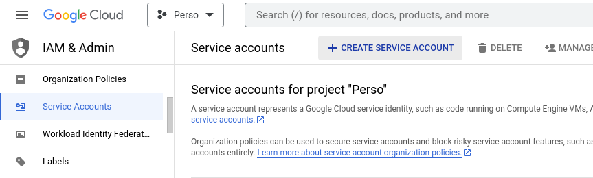
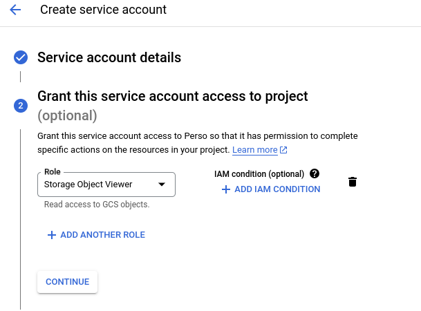
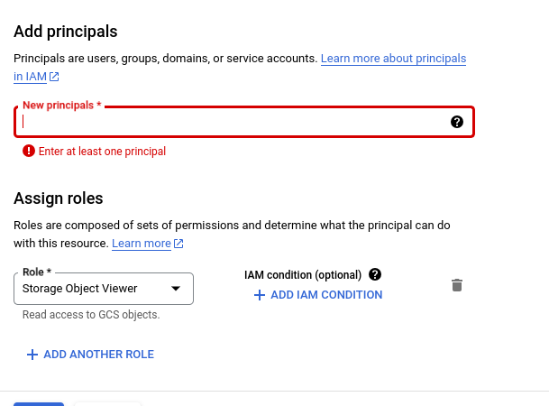
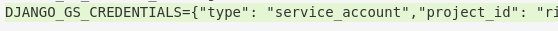

# Setup a google cloud storage

## Create a service account
Storage bucket authentication could be done through a key generated from a service account which have right permissions.

In [google cloud console](https://console.cloud.google.com/) service accounts are created in **IAM & Admin / Service Accounts / create service account**

## Assign the right role
For instance **Storage object viewer**

## Create a bucket
**Cloud storage > Buckets > Create**

## Assign service account
In a created bucket, **Permissions > View by principals > Grant access**

Then copy paste the identifier of the service account, which looks like an email adress, in the **New Principals** field, then select a role:

## Download service account key
In created service account, go to **Keys > Add keys** and create a json key. Once downloaded, copy paste the content of the json file in a one-line string in **.env** file to match **DJANGO_GS_CREDENTIALS** environnement variable:

